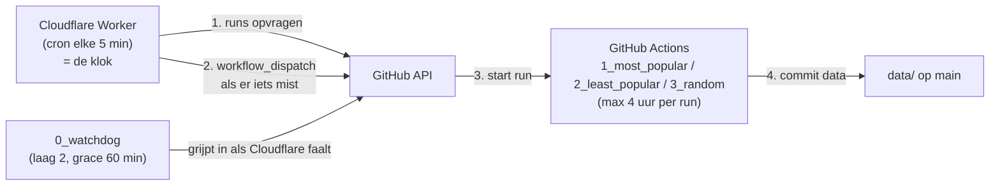

# Concept: Cloudflare Worker als klok voor de GitHub-workflows

> **Status: concept / nog niet geïmplementeerd** — 13-09-2026
> Doel: de dagtaken betrouwbaar op tijd starten **zonder** GitHub's planner en
> **zonder** een laptop die 24/7 aan moet staan.

Dit document staat op zichzelf: het bevat de aanleiding (met metingen), het
ontwerp, de kant-en-klare Worker-code, het uitrolplan en de openstaande keuzes.
Het is bedoeld om later terug te lezen, ook als de chat-historie weg is.

---

## 1. Waarom dit nodig is

De timing van deze repo liep via GitHub's `schedule`. Dat is **gedocumenteerd
"best effort"** — dit staat letterlijk in de GitHub-docs bij het
`schedule`-event:

> The `schedule` event **can be delayed** during periods of high loads of
> GitHub Actions workflow runs. High load times include **the start of every
> hour**. If the load is sufficiently high enough, **some queued jobs may be
> dropped**. To decrease the chance of delay, schedule your workflow to run at
> a different time of the hour.

In de praktijk op deze repo (gemeten 13-09-2026):

| geplande cron (UTC) | werkelijk gestart | vertraging |
|---|---|---|
| 23:00 | 00:42 | **+102 min** |
| 07:00 | 12:28 | **+328 min** |
| 15:00 | 17:43 | **+163 min** |

En de gevolgen daarvan:

* Start zo'n late run **bovenop een run die nog bezig is** (max. 1 tegelijk,
  `concurrency`), dan gaat hij in de wachtrij: gemeten **191 min** en
  **98 min** wachttijd.
* Een uitgestelde run kon een **leeg rondje van 13 seconden** worden (run #26):
  de run startte zo laat dat het dynamische budget al op was.
* Op 13-09-2026 rond 19:40 NL is een geplande run **helemaal niet verschenen**:
  geen run, geen `pending`, niets in de wachtrij, geen log.
* De nieuwe workflows (20:35 / 04:35 / 12:35 NL) hadden om 20:44 NL nog
  **0 runs** en **niets** in de wachtrij, terwijl het 20:35-slot al voorbij was.
  (Dat kan "gedropt" zijn of "nieuwe cron nog niet geregistreerd" — dat is van
  buitenaf niet te onderscheiden.)

Wat GitHub **niet** biedt, en wat het extra frustrerend maakt:

* geen queue-overzicht van geplande runs;
* geen "next run in …"-indicatie;
* geen log van de planner zelf;
* een gemiste run is dus alleen merkbaar als **afwezigheid** — er is niets om
  naar te kijken.

**Conclusie:** GitHub Actions is prima *rekenkracht*, maar geen betrouwbare
*klok*. Voor een proces dat gewoon moet draaien is dat onacceptabel.

**En waarom geen laptop/on-prem als klok?** Dat is precies de verkeerde
afhankelijkheid: een cloudproces aansturen vanaf een machine die in slaapstand
gaat, updates krijgt of uit staat. Fragiel, en het maakt de "cloud" alsnog
afhankelijk van iets lokaals.

### Wat er al als pleister ligt

`.github/workflows/0_watchdog.yml` + `watchdog_check.py`: elke 30 minuten kijken
of een dagtaak gedraaid is en hem anders zelf starten met `workflow_dispatch`.
Dat helpt (en gebruikt het ingebouwde `GITHUB_TOKEN`, dus geen PAT), maar de
watchdog hangt **zelf ook aan dezelfde planner**. Het is laag 2, geen oplossing
voor het klok-probleem.

---

## 2. De oplossing in één zin

Een **Cloudflare Worker met een Cron Trigger** (elke 5 minuten) die zelf de
**Nederlandse klok** uitrekent en per taak beslist: is het geplande moment
voorbij en bestaat er geen run sinds dat moment? → dan start hij de taak via
`workflow_dispatch`. GitHub blijft het werk doen, Cloudflare wordt de klok.

Waarom Cloudflare Workers:

| eigenschap | waarom het uitmaakt |
|---|---|
| gratis (100.000 requests/dag, 5 cron triggers per account) | wij gebruiken ~288 tikken/dag en 1 cron |
| **Cron Events + Workers Logs** in het dashboard | precies de historie die GitHub mist: de laatste 100 invocaties, plus doorzoekbare logs |
| secrets voor de token | de PAT staat niet in de repo |
| geen server, geen laptop, geen onderhoud | cron draait op Cloudflare's edge |
| kan de watchdog-logica overnemen | dan is GitHub's planner volledig uit de kritieke route |

---

## 3. Architectuur



Drie lagen, met verschillende verantwoordelijkheid:

| laag | wie | wanneer | rol |
|---|---|---|---|
| 1 | Cloudflare Worker | elke 5 min | **klok**: start de taak binnen ~5 min na het geplande moment |
| 2 | `0_watchdog` (GitHub) | elke 30 min, grace 60 min | vangnet als Cloudflare zelf niet draait |
| 3 | `schedule:` in de workflowbestanden | 20:35 / 04:35 / 12:35 NL | fallback; **uitzetten zodra laag 1 bewezen is** (zie §12) |

Omdat alle drie "bestaat er al een run sinds het slot?" vragen, starten ze geen
dubbele runs zolang de eerdere laag zijn werk heeft gedaan.

---

## 4. De taken

De taken staan in de Worker geconfigureerd (bestand + gewenste NL-tijd):

| taak | bestand | NL-tijd | huidige cron in het bestand |
|---|---|---|---|
| 1_most_popular | `1_most_popular.yml` | 20:35 | `35 20 * * *` + `timezone: Europe/Amsterdam` |
| 2_least_popular | `2_least_popular.yml` | 04:35 | `35 4 * * *` + `timezone: Europe/Amsterdam` |
| 3_random | `3_random.yml` | 12:35 | `35 12 * * *` + `timezone: Europe/Amsterdam` |

Die taken staan 8 uur uit elkaar en elke run heeft een budget van 4 uur
(`RUN_BUDGET_MIN=240`, job-timeout 260 min). Daardoor kan een late start de
volgende taak niet in de weg lopen.

---

## 5. Werking (de logica)

1. De cron tikt **elke 5 minuten** (UTC; Cloudflare-cron kent geen tijdzones).
2. De Worker rekent de **NL-tijd** uit met `Intl.DateTimeFormat` met
   `timeZone: "Europe/Amsterdam"` → dus automatisch zomer-/wintertijd goed.
3. Per taak: `minutenSindsSlot = nu (NL) − geplande tijd`, met +1440 als het
   geplande moment vandaag nog niet geweest is (dan was het slot gisteren).
4. Beslissing:
   * `minutenSindsSlot < GRACE_MIN (5)` → niets doen (het slot is net geweest);
   * `> MAX_LATE_H (8) × 60` → niets doen (te oud; de volgende taak is aan de
     beurt — voorkomt dat de Worker alle gemiste slots van een dag start);
   * er **is** een run sinds het slot → niets doen;
   * anders → `workflow_dispatch` en loggen.
5. Het "slot" wordt omgerekend naar een **tijdstip** (`nu − minutenSindsSlot`),
   en daarmee vergeleken met `created_at` van de runs. Zo is er nergens
   tijdzone-rekenwerk met datums nodig.
6. **Idempotent**: na een geslaagde dispatch bestaat de run, dus de volgende
   tik ziet hem en doet niets. Geen dubbele starts.

---

## 6. De Worker-code (concept)

`src/index.js`:

```js
// Cloudflare Worker: klok voor de SteamDataOfficial dagtaken.
// Secret:  wrangler secret put GITHUB_TOKEN
// Var:     DRY_RUN = "true"  -> alleen loggen, niets starten

const OWNER = "Yookiop";
const REPO = "SteamDataOfficial";
const REF = "main";
const TZ = "Europe/Amsterdam";
const API = "https://api.github.com";

// bestand + het moment (NL-tijd) waarop de run gestart moet zijn
const TASKS = [
  { file: "1_most_popular.yml", at: "20:35" },
  { file: "2_least_popular.yml", at: "04:35" },
  { file: "3_random.yml", at: "12:35" },
];

const GRACE_MIN = 5;   // zo lang mag GitHub's eigen planner nog zelf starten
const MAX_LATE_H = 8;  // een ouder slot halen we niet meer in

function nlNow(date) {
  const parts = new Intl.DateTimeFormat("en-CA", {
    timeZone: TZ, hour: "2-digit", minute: "2-digit", hour12: false,
  }).formatToParts(date);
  const get = (type) => Number(parts.find((p) => p.type === type).value);
  return { hour: get("hour"), minute: get("minute") };
}

function gh(env, path, init = {}) {
  return fetch(API + path, {
    ...init,
    headers: {
      Authorization: `Bearer ${env.GITHUB_TOKEN}`,
      Accept: "application/vnd.github+json",
      "X-GitHub-Api-Version": "2022-11-28",
      ...(init.body ? { "Content-Type": "application/json" } : {}),
    },
  });
}

async function hasRunSince(env, file, sinceMs) {
  const res = await gh(env, `/repos/${OWNER}/${REPO}/actions/workflows/${file}/runs?per_page=5`);
  if (!res.ok) throw new Error(`runs ${file}: HTTP ${res.status}`);
  const data = await res.json();
  return data.workflow_runs.some((run) => new Date(run.created_at).getTime() >= sinceMs);
}

async function dispatch(env, file) {
  const res = await gh(env, `/repos/${OWNER}/${REPO}/actions/workflows/${file}/dispatches`, {
    method: "POST",
    body: JSON.stringify({ ref: REF }),
  });
  if (res.status !== 204) throw new Error(`dispatch ${file}: HTTP ${res.status} ${await res.text()}`);
}

export default {
  async scheduled(controller, env, ctx) {
    const now = new Date(controller.scheduledTime ?? Date.now());
    const { hour, minute } = nlNow(now);
    const nowMin = hour * 60 + minute;

    for (const task of TASKS) {
      const [h, m] = task.at.split(":").map(Number);
      let diff = nowMin - (h * 60 + m);
      if (diff < 0) diff += 1440;           // slot was gisteren
      if (diff < GRACE_MIN) continue;        // net geweest
      if (diff > MAX_LATE_H * 60) continue;  // te oud

      const slotMs = now.getTime() - diff * 60_000;
      try {
        if (await hasRunSince(env, task.file, slotMs)) {
          console.log(`${task.file}: klaar`);
          continue;
        }
        if (env.DRY_RUN === "true") {
          console.log(`[dry-run] ${task.file}: MIST sinds ${new Date(slotMs).toISOString()}`);
          continue;
        }
        await dispatch(env, task.file);
        console.log(`${task.file}: MIST -> gestart`);
      } catch (err) {
        console.log(`! ${task.file}: ${err.message} (volgende tik opnieuw)`);
      }
    }
  },
};
```

Optioneel (zichtbaarheid): in de `catch` of na een geslaagde dispatch een
GitHub-issue openen/commenten, zodat je een e-mail krijgt in plaats van stilte.

---

## 7. Configuratie en uitrol

`wrangler.toml`:

```toml
name = "steamdata-trigger"
main = "src/index.js"
compatibility_date = "2026-09-13"

# Cloudflare-cron is UTC-only; de Worker rekent zelf de NL-tijd uit.
[triggers]
crons = ["*/5 * * * *"]

[vars]
DRY_RUN = "true"   # eerst een dag droog draaien, daarna "false"
```

Uitrol:

```sh
npm install -g wrangler
wrangler login
wrangler secret put GITHUB_TOKEN     # plak de PAT (zie §8)
wrangler deploy
wrangler tail                        # live logs

# lokaal testen zonder te wachten op de cron:
wrangler dev
curl "http://localhost:8787/cdn-cgi/local/scheduled?format=json"
```

Alternatief zonder CLI: Worker aanmaken in het dashboard (Workers & Pages →
Create → Hello World → Edit code), code plakken, secret zetten onder Settings →
Variables, en de cron onder Settings → Triggers → Cron Triggers.

**Historie bekijken** (dit is de winst ten opzichte van GitHub):
Workers & Pages → jouw Worker → Settings → Trigger Events → **View events**
(de laatste 100 cron-invocaties), plus Workers Logs voor langere retentie.
Let op: bij een nieuwe Worker kan het tot ~30 min duren voor events zichtbaar
zijn, en wijzigingen aan cron-triggers kunnen tot 15 min nodig hebben om door
te werken.

---

## 8. De token (PAT)

* Fine-grained PAT, **alleen deze repo**, rechten **Actions: Read and write**
  (write omvat read; dat is genoeg voor zowel runs lezen als dispatchen).
* Alleen als **Cloudflare-secret** (`GITHUB_TOKEN`), nooit in de repo, nooit in
  een log.
* Zet een vervaldatum en noteer hier wanneer je moet roteren:
  vervaldatum: `…` — geroteerd op: `…`.

---

## 9. Kosten en limieten

Relevante limieten van het **gratis** Workers-plan:

| limiet | waarde | onze inschatting |
|---|---|---|
| requests | 100.000/dag | 288 cron-tikken + ~900 API-calls/dag = **< 1,5%** |
| cron triggers per account | 5 | 1 |
| CPU-tijd per cron-invocatie | **10 ms** | krap maar haalbaar; daarom `per_page=5` (kleine responses). Wachten op `fetch()` telt **niet** mee als CPU |
| subrequests per invocatie | 50 | max 3 runs-checks + 3 dispatches = 6 |
| wall time per cron-invocatie | 15 min | seconden |

Wordt 10 ms CPU toch een probleem (bijv. door grotere responses), dan is het
betaalde plan ($5/mnd) de uitweg: 30 s CPU. Eerst meten.

---

## 10. Risico's en beperkingen (eerlijk)

* Ook Cloudflare's scheduler is geen contractuele garantie — maar wel
  meetbaar punctueler én **zichtbaar** (Cron Events). Bewijs moet uit de
  meting in §11 komen, niet uit beloftes.
* Als Cloudflare een dispatch accepteert maar de run niet start, grijpt laag 2
  (`0_watchdog`) in. Daarom blijft die staan.
* Dubbele runs zijn niet fataal (de `concurrency`-groep serialiseert ze en de
  max-1×-per-dag-regel voorkomt dubbel werk per game), maar kosten wel tijd.
* De Worker moet weten hoe de taken heten: bij een nieuwe taak moet de
  `TASKS`-lijst mee (kleine, bewuste duplicatie).
* PAT-rotatie is handwerk; zonder geldige token doet de Worker niets (en dat
  zie je in de logs — hij faalt zichtbaar, niet stil).

---

## 11. Uitrol- en meetplan

1. Cloudflare-account + `wrangler login`.
2. Worker deployen met `DRY_RUN = "true"`, cron elke 5 min.
3. **Een dag droog draaien**: in de logs moet precies 3× "MIST" verschijnen, op
   ~20:40, ~04:40 en ~12:40 NL. Alles daarbuiten = logica-fout.
4. `DRY_RUN = "false"` en deployen.
5. **Een week meten**: per dag de `created_at` van de drie runs vergelijken met
   20:35 / 04:35 / 12:35 NL. Doel: binnen 5 minuten. Vastleggen in een tabel:

   | datum | 1_most_popular | 2_least_popular | 3_random |
   |---|---|---|---|
   | … | … | … | … |
6. Als dat een week goed gaat: de `schedule:`-blokken uit de drie
   workflowbestanden halen (anders blijven er twee klokken naar dezelfde taak
   wijzen) en `0_watchdog` laten staan als laag 2.
7. Rollback: Worker verwijderen; de `schedule:`-regels terugzetten. Er
   verandert niets aan de data of de workflows zelf.

---

## 12. Openstaande beslissingen

1. **Cloudflare-account**: nieuw of bestaand?
2. **Melding bij ingrijpen**: ook een GitHub-issue openen als de Worker een
   gemiste taak start (e-mail-alert), of alleen loggen?
3. **GitHub-crons uitzetten**: pas doen na de meetweek (§11 stap 6). Tot die
   tijd kunnen er dubbele runs voorkomen — acceptabel, of meteen uitzetten?
4. **Laag 2 wel of niet houden**: advies is houden (grace 60 min), tenzij de
   meetweek aantoont dat Cloudflare alles zelf afvangt.
5. **CPU-limiet**: gratis plan (10 ms) aanhouden of meteen betaald?

---

## 13. Alternatieven (kort)

| optie | kosten | waarom wel/niet |
|---|---|---|
| **Cloudflare Workers + Cron** | gratis | **keuze**: cron-historie + logs, secrets, geen server |
| cron-job.org | gratis | simpele HTTP-cron, maar minder inzicht in historie; eerder al geprobeerd |
| AWS EventBridge Scheduler | ~gratis | prima, maar meer AWS-gedoe voor één POST |
| Google Cloud Scheduler | 3 jobs gratis | idem, prima tweede keuze |
| EasyCron | gratis tier | minste garanties/logging |
| VPS met cron | €3-5/mnd | meeste controle, maar wél een machine om te onderhouden |
| laptop / Taakplanner | "gratis" | **afgeraden**: machine moet aan staan, fragiel |

---

## Bijlage: wat we hier leerden over GitHub Actions

* `schedule` is best effort: vertraging tot uren, en runs kunnen vervallen
  zonder enig spoor.
* Crons op het hele uur zijn het slechtst (drukste moment) → daarom staan onze
  taken op :35.
* Zware runs (4-5,5 uur) + 1-per-taal `concurrency` betekent: een late start
  loopt in de wachtrij van een voorganger. Spreiding van 8 uur met 4 uur werk
  voorkomt dat.
* Er is geen queue-, next-run- of planner-log. "Er is niets gebeurd" is niet te
  onderscheiden van "het is nog niet geregistreerd".
* Het ingebouwde `GITHUB_TOKEN` mág wél een `workflow_dispatch` doen (dat is de
  gedocumenteerde uitzondering) — daarom kan een watchdog zonder PAT werken.
