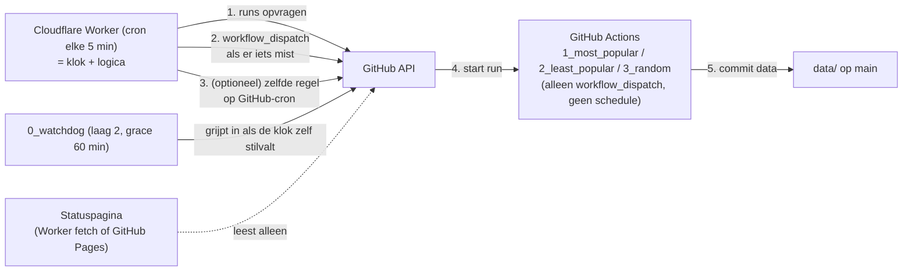

# Schedule-orchestratie: één klok, één plek

> **Status: concept / nog niet geïmplementeerd** — 13-09-2026
> Doel: de dagtaken betrouwbaar op tijd starten **zonder** GitHub's planner
> (die "best effort" is) en **zonder** een laptop die 24/7 aan moet staan.

Dit document heette eerder `cloudflare-trigger.md`. Het is breder getrokken: het
gaat over **waar de klok woont en waar de orchestration-logica woont**, niet over
één leverancier. Cloudflare is op dit moment de meest logische kandidaat, maar
GitHub Pages, Google Apps Script en een GitHub-workflow die zelf dispatchet staan
er net zo goed in.

Het staat op zichzelf: aanleiding (met metingen), ontwerp, kant-en-klare
Worker-code als referentie-implementatie, uitrolplan en openstaande keuzes.
Bedoeld om later terug te lezen, ook als de chat-historie weg is.

---

## 1. Het uitgangspunt: één klok, één plek

Letterlijke eis (13-09-2026):

> de orchestratie van Jobs op 1 plek ... en niet dat cloudflare via de api Jobs
> aftrapt en github zelf ook nog de onbetrouwbare schedules op de Jobs heeft.
> Dan zouden we de triggers van de 3 Jobs kunnen afhalen en het volledig via de
> orchestrator laten afhandelen.

Daar hoort één scherp onderscheid bij, want dat bepaalt de rest van het ontwerp:

| | wel | niet |
|---|---|---|
| **logica** | **exact één plek** die weet welke taak wanneer moet lopen en of dat al gebeurd is | meerdere plekken die elk hun eigen idee hebben over "wat moet er nu gebeuren" |
| **tikken** (cron/klok) | mogen er **meerdere** zijn | — |

Dat lijkt in tegenspraak met "één klok", maar is het niet: zolang **elke** tik
door dezelfde idempotente regel gaat ("is het werk voor dit slot al gedaan?"),
kan een tweede tikbron geen tweede run veroorzaken. Het gevaar is niet *twee
keer tikken*, het gevaar is *twee plekken met eigen logica* — dat is precies wat
we nu hebben: drie jobbestanden met elk een eigen `schedule:` en daarnaast een
watchdog met een eigen regel.

**Ontwerpprincipe:**

1. De drie jobbestanden worden **dom**: ze doen hun werk en hebben **alleen nog
   `workflow_dispatch`** — geen `schedule:`.
2. Er komt **één orchestrator** met de logica + de "is het werk gedaan?"-controle.
3. De orchestrator mag door **meerdere tikbronnen** wakker gemaakt worden
   (bijv. Cloudflare-cron én GitHub's `schedule` op de orchestrator). Elke tik
   loopt door dezelfde regel, dus redundantie is gratis en levert geen dubbele
   runs.

---

## 2. Waarom dit nodig is

De timing van deze repo liep via GitHub's `schedule`. Dat is **gedocumenteerd
"best effort"** — letterlijk uit de GitHub-docs bij het `schedule`-event:

> The `schedule` event **can be delayed** during periods of high loads of
> GitHub Actions workflow runs. High load times include **the start of every
> hour**. If the load is sufficiently high enough, **some queued jobs may be
> dropped**. To decrease the chance of delay, schedule your workflow to run at
> a different time of the hour.

Gemeten op deze repo (13-09-2026):

| geplande cron (UTC) | werkelijk gestart | vertraging |
|---|---|---|
| 23:00 | 00:42 | **+102 min** |
| 07:00 | 12:28 | **+328 min** |
| 15:00 | 17:43 | **+163 min** |

En de gevolgen daarvan:

* Start zo'n late run **bovenop een run die nog bezig is** (max. 1 tegelijk,
  `concurrency`), dan gaat hij in de wachtrij: gemeten **191 min** en
  **98 min** wachttijd.
* Een uitgestelde run kon een **leeg rondje van 13 seconden** worden (run #26):
  de run startte zo laat dat het dynamische budget al op was.
* Op 13-09-2026 rond 19:40 NL is een geplande run **helemaal niet verschenen**:
  geen run, geen `pending`, niets in de wachtrij, geen log.
* De nieuwe workflows (20:35 / 04:35 / 12:35 NL) hadden om 20:44 NL nog
  **0 runs** en **niets** in de wachtrij, terwijl het 20:35-slot al voorbij was.
  (Dat kan "gedropt" zijn of "nieuwe cron nog niet geregistreerd" — van buitenaf
  is dat niet te onderscheiden.)

Wat GitHub **niet** biedt, en wat het extra frustrerend maakt:

* geen queue-overzicht van geplande runs;
* geen "next run in …"-indicatie;
* geen log van de planner zelf;
* een gemiste run is dus alleen merkbaar als **afwezigheid** — er is niets om
  naar te kijken.

**Conclusie:** GitHub Actions is prima *rekenkracht*, maar geen betrouwbare
*klok*. Voor een proces dat gewoon moet draaien is dat onacceptabel.

**Waarom geen laptop/on-prem als klok?** Dat is precies de verkeerde
afhankelijkheid: een cloudproces aansturen vanaf een machine die in slaapstand
gaat, updates krijgt of uit staat. Fragiel, en het maakt de "cloud" alsnog
afhankelijk van iets lokaals.

---

## 3. Wat er nu ligt (en wat het waard is)

| onderdeel | wat het doet | tekortkoming |
|---|---|---|
| `1_most_popular.yml` / `2_least_popular.yml` / `3_random.yml` | eigen `schedule:` (20:35 / 04:35 / 12:35 NL, met `timezone: Europe/Amsterdam`) + `workflow_dispatch` | drie losse klokken met de onbetrouwbare planner; de klok zit ín het zware werk (4 uur per run) |
| `0_watchdog.yml` + `watchdog_check.py` | elke 30 min controleren of een dagtaak gedraaid is, anders zelf starten | **hangt zelf ook aan dezelfde planner**; het is een pleister, geen klok |

Stand van zaken op 13-09-2026 (21:00 NL): de watchdog heeft 1 run gehad (de
handmatige van Yookiop, 18:48 UTC, geslaagd in 8 s) en **0 geplande runs**; de
drie dagtaken hadden 0 geplande runs (`1_most_popular` had één handmatige run,
gestart 20:52 NL). De nieuwe crons hebben dus nog niet aangetoond dat ze werken.

---

## 4. Wat een orchestrator moet kunnen

| eis | waarom |
|---|---|
| een klok/cron zonder dat een machine aan moet staan | anders blijft het fragiel |
| HTTP POST kunnen doen met een geheim | een `workflow_dispatch` vereist een token |
| geheimen kunnen bewaren (niet in de repo, niet in de browser) | een PAT in een statische pagina is voor iedereen leesbaar |
| status/geschiedenis tonen | dit is precies wat GitHub mist: "heeft de klok getikt?" |
| idempotent kunnen werken | meerdere tikbronnen mogen geen dubbele runs geven |
| gratis (of bijna) + geen onderhoud | het is een hulpmiddel, geen project |

---

## 5. Kan GitHub Pages dit? (nee voor de klok, ja als dashboard)

Pages is **statische hosting**: HTML/CSS/JS uit de repo, meer niet. Er is geen
server die code uitvoert, dus **geen cron, geen achtergrondtaak, geen POST naar
de GitHub-API**. Een pagina doet alleen iets op het moment dat iemand hem opent.

| vraag | antwoord |
|---|---|
| kan een Pages-site op vaste tijden de 3 jobs starten? | **nee** — er is geen executor en geen cron |
| kan een Pages-site op een knop de jobs starten? | technisch ja, maar dan moet er een **PAT in de JavaScript** staan → iedereen kan hem lezen en misbruiken. Pages kan geen secrets bewaren. |
| kan een Pages-site tonen wat de status is? | **ja** — de run-overzichten van een publieke repo zijn zonder token te lezen (runs, `status`, `conclusion`, laatste commit). Dat is een nuttig dashboard, geen orchestrator. |
| kan een Pages-site de externe klok vervangen? | nee. Een pagina die door een workflow met `schedule` gebouwd wordt, heeft GitHub's planner als klok → precies wat we niet willen. |

Limieten van Pages (docs, gratis, publieke repo): site max **1 GB**, soft
**100 GB/maand** bandbreedte, soft **10 builds/uur** (geldt niet als je met een
eigen Actions-workflow bouwt), deploy-timeout **10 min**, **één site per repo**.
Een statuspagina zit daar mijlenver onder. Let op de TOS: Pages is niet bedoeld
voor commerciële transacties of gevoelige data — een statische statuspagina is
prima.

**Conclusie:** Pages is een **voorkant**, geen orchestrator. Wil je het dashboard
op dezelfde plek als de klok, dan kan dat beter met **Workers Static Assets**
(dezelfde Worker serveert dan ook de pagina) of met een
`fetch`-handler in de Worker (§10) — dan is het letterlijk één plek.

---

## 6. Opties vergeleken

| optie | klok? | secrets? | historie/zichtbaarheid | kosten | oordeel |
|---|---|---|---|---|---|
| **Cloudflare Worker + Cron Trigger** | ja (minuutgranulariteit) | ja (`wrangler secret`) | **Cron Events: laatste 100 invocaties + Workers Logs** | gratis (100k req/dag, 5 crons, 10 ms CPU/tik) | **aanbevolen**: dit is de enige optie die de klok én de logica op één plek zet met echte tikhistorie |
| Cloudflare Worker + Static Assets (dashboard erbij) | ja | ja | idem + eigen statuspagina | gratis | **aanbevolen als je de "ene plek" ook visueel wilt** (dan is GitHub Pages niet nodig) |
| **GitHub Actions als enige orchestrator** (1 bestand met 3 crons dat de 3 jobbestanden dispatcht) | ja, maar met dezelfde onbetrouwbare planner | ja, en zelfs het ingebouwde `GITHUB_TOKEN` volstaat (geen PAT!) | gewone run-historie | gratis | **sterke tussenstap**: centraliseert de logica met 0 nieuwe accounts en 0 secrets; als extra tikbron naast een externe klok juist heel nuttig |
| GitHub Pages | **nee** (statisch, geen executor) | **nee** | kan publieke run-data tonen | gratis | alleen als statuspagina; niet als klok |
| Google Apps Script (time-driven trigger) | ja (per minuut) | ja (Script Properties) | uitvoeringslog in het dashboard | gratis (ruime dagquota) | goede tweede keuze; kan zelfs een web-app als dashboard serveren |
| cron-job.org (eerder geprobeerd) | ja | nee, tenzij de PAT in de URL/headers staat → kwetsbaar | beperkte historie | gratis | alleen bruikbaar als tikbron naar een proxy die het token bewaart |
| Vercel / Netlify scheduled functions | ja | ja | logs | gratis tier | kan, maar nieuw account; gratis plannen zijn beperkt in frequentie en aantal — check de actuele limieten |
| AWS EventBridge Scheduler / Google Cloud Scheduler | ja | ja | logs | ruim binnen gratis laag | prima, maar meer cloud-gedoe voor één POST |
| VPS met cron | ja | ja | alles | €3-5/mnd | meeste controle, maar wél een machine om te onderhouden |
| laptop / Taakplanner | "ja" | ja | eigen logs | "gratis" | **afgeraden**: machine moet aan staan, fragiel, en het maakt de cloud afhankelijk van iets lokaals |

---

## 7. Aanbevolen opzet



| laag | wie | wanneer | rol | eerlijkheid |
|---|---|---|---|---|
| 1 | Cloudflare Worker | elke 5 min | **de klok én de logica**: start de taak binnen ~5 min na het geplande moment | bewezen moet worden met de meetweek (§15) |
| 1b (optioneel) | GitHub-`schedule` **op de orchestrator** | 20:30 / 04:30 / 12:30 NL | extra tikbron voor dezelfde regel | zelfde onbetrouwbare planner, maar schade is nu beperkt: één gemiste tik is geen gemiste run |
| 2 | `0_watchdog` (GitHub) | elke 30 min, grace 60 min | vangnet als laag 1 helemaal stilvalt | hangt zelf aan de planner → geen garantie, alleen een extra kans |
| 3 | `schedule:` in de drie jobbestanden | 20:35 / 04:35 / 12:35 NL | **vervalt** (dit is juist de dubbele logica die weg moet) | — |

Let op: laag 3 is de laag die we per dit ontwerp **weghalen**. Zolang die er nog
staat, zijn er twee plekken met logica en kan er dubbel werk ontstaan.

---

## 8. De taken

De taken staan in de orchestrator geconfigureerd (bestand + gewenste NL-tijd):

| taak | bestand | NL-tijd | huidige cron in het bestand (vervalt) |
|---|---|---|---|
| 1_most_popular | `1_most_popular.yml` | 20:35 | `35 20 * * *` + `timezone: Europe/Amsterdam` |
| 2_least_popular | `2_least_popular.yml` | 04:35 | `35 4 * * *` + `timezone: Europe/Amsterdam` |
| 3_random | `3_random.yml` | 12:35 | `35 12 * * *` + `timezone: Europe/Amsterdam` |

De taken staan 8 uur uit elkaar en elke run heeft een budget van 4 uur
(`RUN_BUDGET_MIN=240`, job-timeout 260 min). Daardoor kan een late start de
volgende taak niet in de weg lopen.

---

## 9. Werking (de logica)

1. De cron tikt **elke 5 minuten** (UTC; Cloudflare-cron kent geen tijdzones).
2. De orchestrator rekent de **NL-tijd** uit met `Intl.DateTimeFormat` met
   `timeZone: "Europe/Amsterdam"` → zomer-/wintertijd automatisch goed, geen
   `timezone:`-optie of UTC-rekenwerk nodig.
3. Per taak: `minutenSindsSlot = nu (NL) − geplande tijd`, met +1440 als het
   geplande moment vandaag nog niet geweest is (dan was het slot gisteren).
4. Beslissing:
   * `minutenSindsSlot < GRACE_MIN (5)` → niets doen (het slot is net geweest);
   * `> MAX_LATE_H (8) × 60` → niets doen (te oud; de volgende taak is aan de
     beurt — voorkomt dat één tik alle gemiste slots van een dag start);
   * er **is** een run sinds het slot → niets doen;
   * anders → `workflow_dispatch` en loggen.
5. Het "slot" wordt omgerekend naar een **tijdstip** (`nu − minutenSindsSlot`) en
   daarmee vergeleken met `created_at` van de runs. Zo is er nergens
   datumrekenwerk met tijdzones nodig.
6. **Idempotent**: na een geslaagde dispatch bestaat de run, dus de volgende tik
   (en elke andere tikbron) ziet hem en doet niets. Geen dubbele starts.
7. Dit is **dezelfde regel** als in `watchdog_check.py` — de bestaande Python is
   de specificatie; de orchestrator is de verhuizing van die regel naar de plek
   waar ook de klok staat.

---

## 10. Referentie-implementatie (Cloudflare Worker)

`src/index.js`:

```js
// Cloudflare Worker: klok + logica voor de SteamDataOfficial dagtaken.
// Secret:  wrangler secret put GITHUB_TOKEN
// Var:     DRY_RUN = "true"  -> alleen loggen, niets starten

const OWNER = "Yookiop";
const REPO = "SteamDataOfficial";
const REF = "main";
const TZ = "Europe/Amsterdam";
const API = "https://api.github.com";

// bestand + het moment (NL-tijd) waarop de run gestart moet zijn
const TASKS = [
  { file: "1_most_popular.yml", at: "20:35" },
  { file: "2_least_popular.yml", at: "04:35" },
  { file: "3_random.yml", at: "12:35" },
];

const GRACE_MIN = 5;   // zo lang mag een andere tikbron het nog zelf doen
const MAX_LATE_H = 8;  // een ouder slot halen we niet meer in

function nlNow(date) {
  const parts = new Intl.DateTimeFormat("en-CA", {
    timeZone: TZ, hour: "2-digit", minute: "2-digit", hour12: false,
  }).formatToParts(date);
  const get = (type) => Number(parts.find((p) => p.type === type).value);
  return { hour: get("hour"), minute: get("minute") };
}

function gh(env, path, init = {}) {
  return fetch(API + path, {
    ...init,
    headers: {
      Authorization: `Bearer ${env.GITHUB_TOKEN}`,
      Accept: "application/vnd.github+json",
      "X-GitHub-Api-Version": "2022-11-28",
      ...(init.body ? { "Content-Type": "application/json" } : {}),
    },
  });
}

async function hasRunSince(env, file, sinceMs) {
  const res = await gh(env, `/repos/${OWNER}/${REPO}/actions/workflows/${file}/runs?per_page=5`);
  if (!res.ok) throw new Error(`runs ${file}: HTTP ${res.status}`);
  const data = await res.json();
  return data.workflow_runs.some((run) => new Date(run.created_at).getTime() >= sinceMs);
}

async function dispatch(env, file) {
  const res = await gh(env, `/repos/${OWNER}/${REPO}/actions/workflows/${file}/dispatches`, {
    method: "POST",
    body: JSON.stringify({ ref: REF }),
  });
  if (res.status !== 204) throw new Error(`dispatch ${file}: HTTP ${res.status} ${await res.text()}`);
}

export default {
  async scheduled(controller, env, ctx) {
    const now = new Date(controller.scheduledTime ?? Date.now());
    const { hour, minute } = nlNow(now);
    const nowMin = hour * 60 + minute;

    for (const task of TASKS) {
      const [h, m] = task.at.split(":").map(Number);
      let diff = nowMin - (h * 60 + m);
      if (diff < 0) diff += 1440;            // slot was gisteren
      if (diff < GRACE_MIN) continue;         // net geweest
      if (diff > MAX_LATE_H * 60) continue;   // te oud

      const slotMs = now.getTime() - diff * 60_000;
      try {
        if (await hasRunSince(env, task.file, slotMs)) {
          console.log(`${task.file}: klaar`);
          continue;
        }
        if (env.DRY_RUN === "true") {
          console.log(`[dry-run] ${task.file}: MIST sinds ${new Date(slotMs).toISOString()}`);
          continue;
        }
        await dispatch(env, task.file);
        console.log(`${task.file}: MIST -> gestart`);
      } catch (err) {
        console.log(`! ${task.file}: ${err.message} (volgende tik opnieuw)`);
      }
    }
  },

  // Optioneel: dezelfde Worker serveert een read-only statuspagina.
  // Zonder secrets in de pagina (de PAT blijft server-side) en zonder GitHub Pages.
  async fetch(request, env) {
    if (new URL(request.url).pathname !== "/") {
      return new Response("not found", { status: 404 });
    }
    const rows = await Promise.all(TASKS.map(async (t) => {
      const res = await gh(env, `/repos/${OWNER}/${REPO}/actions/workflows/${t.file}/runs?per_page=1`);
      const data = await res.json();
      const last = data.workflow_runs[0];
      return `${t.file.padEnd(22)} gepland ${t.at} NL   laatste run: ` +
        (last ? `${last.created_at} ${last.status}/${last.conclusion || "-"} (${last.event})` : "nooit");
    }));
    return new Response(
      `Schedule-orchestratie ${OWNER}/${REPO}\nnu: ${new Date().toISOString()}\n\n${rows.join("\n")}\n`,
      { headers: { "content-type": "text/plain; charset=utf-8" } },
    );
  },
};
```

Optioneel (zichtbaarheid): in de `catch` of na een geslaagde dispatch een
GitHub-issue openen/commenten, zodat je een e-mail krijgt in plaats van stilte.

---

## 11. Configuratie en uitrol

`wrangler.toml`:

```toml
name = "steamdata-trigger"
main = "src/index.js"
compatibility_date = "2026-09-13"

# Cloudflare-cron is UTC-only; de Worker rekent zelf de NL-tijd uit.
[triggers]
crons = ["*/5 * * * *"]

[vars]
DRY_RUN = "true"   # eerst een dag droog draaien, daarna "false"
```

Uitrol:

```sh
npm install -g wrangler
wrangler login
wrangler secret put GITHUB_TOKEN     # plak de PAT (zie §12)
wrangler deploy
wrangler tail                        # live logs

# lokaal testen zonder te wachten op de cron:
wrangler dev
curl "http://localhost:8787/cdn-cgi/local/scheduled?format=json"
```

Alternatief zonder CLI: Worker aanmaken in het dashboard (Workers & Pages →
Create → Hello World → Edit code), code plakken, secret zetten onder Settings →
Variables, en de cron onder Settings → Triggers → Cron Triggers.

**Historie bekijken** (dit is de winst ten opzichte van GitHub):
Workers & Pages → jouw Worker → Settings → Trigger Events → **View events**
(de laatste 100 cron-invocaties), plus Workers Logs voor langere retentie.
Let op: bij een nieuwe Worker kan het tot ~30 min duren voor events zichtbaar
zijn, en wijzigingen aan cron-triggers kunnen tot 15 min nodig hebben om door te
werken.

---

## 12. De token (PAT)

* Fine-grained PAT, **alleen deze repo**, rechten **Actions: Read and write**
  (write omvat read; dat is genoeg voor zowel runs lezen als dispatchen).
* Alleen als **secret van de orchestrator** (Cloudflare-secret / Apps Script
  property / GitHub Actions secret), nooit in de repo, nooit in een log.
* **Nooit in een statische pagina** (GitHub Pages): alles in de browser is
  publiek, en Pages kan geen secrets bewaren. Een dashboard mag dus alleen
  *lezen* wat toch al publiek is.
* Zet een vervaldatum en noteer hier wanneer je moet roteren:
  vervaldatum: `…` — geroteerd op: `…`.

---

## 13. Kosten en limieten

Relevante limieten van het **gratis** Workers-plan:

| limiet | waarde | onze inschatting |
|---|---|---|
| requests | 100.000/dag | 288 cron-tikken + ~900 API-calls/dag = **< 1,5%** |
| cron triggers per account | 5 | 1 |
| CPU-tijd per cron-invocatie | **10 ms** | krap maar haalbaar; daarom `per_page=5` (kleine responses). Wachten op `fetch()` telt **niet** mee als CPU |
| subrequests per invocatie | 50 | max 3 runs-checks + 3 dispatches = 6 |
| wall time per cron-invocatie | 15 min | seconden |

Wordt 10 ms CPU toch een probleem (bijv. door grotere responses), dan is het
betaalde plan ($5/mnd) de uitweg: 30 s CPU. Eerst meten. GitHub Pages kost niets
extra (limieten staan in §5) en een GitHub-Actions-orchestrator ook niet, want
deze repo is publiek.

---

## 14. Risico's en beperkingen (eerlijk)

* Ook Cloudflare's scheduler is geen contractuele garantie — maar wel meetbaar
  punctueler én, belangrijker, **zichtbaar** (Cron Events). Bewijs moet uit de
  meetweek komen, niet uit beloftes.
* **Eén plek = één faalpunt.** Daarom blijft laag 2 (`0_watchdog`) bestaan, of
  komt er een tweede tikbron op dezelfde idempotente regel. Dat is geen tweede
  logica: het is dezelfde regel, andere wekker.
* Als de orchestrator een dispatch accepteert maar de run start niet, grijpt
  laag 2 in.
* Dubbele runs zijn niet fataal (de `concurrency`-groep serialiseert ze en de
  max-1×-per-dag-regel voorkomt dubbel werk per game), maar kosten wel tijd.
* De orchestrator moet weten hoe de taken heten (`TASKS`-lijst): bij een nieuwe
  taak moet die lijst mee. Kleine, bewuste duplicatie — één plek in plaats van
  drie.
* PAT-rotatie is handwerk; zonder geldige token doet de orchestrator niets (en
  dat zie je in de logs — hij faalt zichtbaar, niet stil).
* GitHub Pages kan geen secrets bewaren; een pagina mag dus nooit een token
  bevatten.

---

## 15. Uitrol- en meetplan

1. Kies de tikbron(nen) (§16, punt 1) en de orchestrator (§16, punt 2).
2. Orchestrator bouwen en deployen met `DRY_RUN = "true"`, cron elke 5 min.
   GitHub blijft intussen gewoon zoals het is — er verandert nog niets.
3. **Een dag droog draaien**: in de logs moet precies 3× "MIST" verschijnen, op
   ~20:40, ~04:40 en ~12:40 NL. Alles daarbuiten = logica-fout.
4. `DRY_RUN = "false"`. De orchestrator start nu zelf.
5. **De `schedule:`-blokken uit de drie jobbestanden halen** (dit is de kern van
   de opzet: één plek voor de logica, geen tweede klok meer op de jobs).
   Vanaf dit moment is de orchestrator de enige plek die beslist.
6. **Een week meten**: per dag de `created_at` van de drie runs vergelijken met
   20:35 / 04:35 / 12:35 NL. Doel: binnen 5 minuten. Vastleggen:

   | datum | 1_most_popular | 2_least_popular | 3_random |
   |---|---|---|---|
   | … | … | … | … |

7. Daarna beslissen of laag 2 (`0_watchdog`) blijft of uitgaat.
8. Rollback is klein: `schedule:`-blokken terugzetten (één commit) en de
   orchestrator verwijderen. Aan de data of de jobinhoud verandert niets.

Volgorde-risico: tussen stap 4 en 5 bestaan er tijdelijk twee plekken met
logica. Dat levert geen dubbele run op zolang de jobbestanden hun eigen
`schedule:` nog hebben én de orchestrator ziet dat de run er al is (dat is
precies de idempotente regel) — maar houd die periode kort.

---

## 16. Openstaande beslissingen

1. **Tikbron(nen)**: alleen de externe klok (strikt "één klok"), of de externe
   klok **plus** GitHub's `schedule` op de orchestrator als gratis extra
   wekker? Dat laatste is verdedigbaar zodra de logica op één plek staat, want
   een gemiste tik is dan geen gemiste run.
2. **Cloudflare-account**: nieuw of bestaand, en beheer via `wrangler` of via
   het dashboard?
3. **Dashboard**: Workers Static Assets / `fetch`-handler in de Worker
   (aanbevolen: één plek), of toch GitHub Pages (los, read-only), of niets?
4. **Laag 2 wel of niet houden**: advies is houden (grace 60 min), tenzij de
   meetweek aantoont dat de externe klok alles zelf afvangt.
5. **Melding bij ingrijpen**: een GitHub-issue openen als de orchestrator een
   gemiste taak start (e-mail-alert), of alleen loggen?
6. **CPU-limiet**: gratis plan (10 ms) aanhouden of meteen betaald?
7. **De 3 jobbestanden**: alleen `schedule:` eruit, of ook de nu nog
   aanwezige `workflow_dispatch`-uitleg opruimen zodat ze echt "dom" zijn?

---

## Bijlage: wat we hier leerden over GitHub Actions

* `schedule` is best effort: vertraging tot uren, en runs kunnen vervallen
  zonder enig spoor.
* Crons op het hele uur zijn het slechtst (drukste moment) → daarom staan onze
  taken op :35.
* Zware runs (4-5,5 uur) + 1-tegelijk-`concurrency` betekent: een late start
  loopt in de wachtrij van een voorganger. Spreiding van 8 uur met 4 uur werk
  voorkomt dat.
* Er is geen queue-, next-run- of planner-log. "Er is niets gebeurd" is niet te
  onderscheiden van "het is nog niet geregistreerd".
* Het ingebouwde `GITHUB_TOKEN` mág wél een `workflow_dispatch` doen (dat is de
  gedocumenteerde uitzondering) — daarom kan een orchestrator **binnen** GitHub
  zonder PAT werken (en heeft een externe orchestrator er juist wél een nodig).
* De job-samenvatting (`GITHUB_STEP_SUMMARY`) is van buitenaf niet te
  controleren: de `check-runs`-API laat voor Actions-jobs `output.title`,
  `.summary` én `.text` leeg, en de publieke run-pagina toont een placeholder.
  Alleen ingelogd (of via het step-log) is die te zien.
