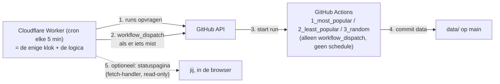

# Schedule-orchestratie: één klok, één plek

> **Status: concept / nog niet geïmplementeerd** — 13-09-2026
> Doel: de dagtaken betrouwbaar op tijd starten **zonder** GitHub's planner
> (die "best effort" is) en **zonder** een laptop die 24/7 aan moet staan.

Dit document heette eerder `cloudflare-trigger.md`. Het gaat over **waar de klok
woont en waar de orchestration-logica woont**. Cloudflare Workers is de gekozen
kandidaat; de andere opties staan verderop kort naast elkaar (§6).

Het staat op zichzelf: aanleiding (met metingen), ontwerp, kant-en-klare
Worker-code als referentie-implementatie, uitrolplan en openstaande keuzes.
Bedoeld om later terug te lezen, ook als de chat-historie weg is.

---

## 1. Het uitgangspunt: één klok, één plek

Letterlijke eis (13-09-2026):

> de orchestratie van Jobs op 1 plek ... en niet dat cloudflare via de api Jobs
> aftrapt en github zelf ook nog de onbetrouwbare schedules op de Jobs heeft.
> Dan zouden we de triggers van de 3 Jobs kunnen afhalen en het volledig via de
> orchestrator laten afhandelen.

Daar hoort één scherp onderscheid bij, want dat bepaalt de rest van het ontwerp:

| | wel | niet |
|---|---|---|
| **logica** | **exact één plek** die weet welke taak wanneer moet lopen en of dat al gebeurd is | meerdere plekken die elk hun eigen idee hebben over "wat moet er nu gebeuren" |
| **tikken** (cron/klok) | één externe klok, die alle taken langs dezelfde idempotente regel stuurt | losse GitHub-crons op de taken zelf |

**Uitgangspunt (13-09-2026): GitHub-crons zo veel mogelijk voorkomen.** Elke
GitHub-`schedule` is een tweede plek met logica en hangt aan een planner die niet
te bewaken is (§2). Daarom is besloten:

1. De drie jobbestanden zijn **dom**: ze doen hun werk en hebben **alleen nog
   `workflow_dispatch`** — geen `schedule:`. *Uitgevoerd op 13-09-2026.*
2. Er komt **één orchestrator** met de logica + de "is het werk gedaan?"-controle:
   de Cloudflare Worker. Die heeft de enige cron in het hele systeem.
3. De **watchdog is vervallen** (`0_watchdog.yml` + `watchdog_check.py` zijn
   verwijderd). Zijn regel ("is er al een run sinds het slot?") zit nu in de
   orchestrator, want precies die regel is wat elke tik hoort te doen.

Technisch is een tweede tikbron ongevaarlijk — zolang elke tik door dezelfde
regel gaat kan hij geen tweede run veroorzaken. Maar hij is niet nodig, en een
GitHub-cron erbij zetten is een extra afhankelijkheid van de planner die we juist
willen vermijden. Dus: **één klok**.

---

## 2. Waarom dit nodig is

De timing van deze repo liep via GitHub's `schedule`. Dat is **gedocumenteerd
"best effort"** — letterlijk uit de GitHub-docs bij het `schedule`-event:

> The `schedule` event **can be delayed** during periods of high loads of
> GitHub Actions workflow runs. High load times include **the start of every
> hour**. If the load is sufficiently high enough, **some queued jobs may be
> dropped**. To decrease the chance of delay, schedule your workflow to run at
> a different time of the hour.

Gemeten op deze repo (13-09-2026):

| geplande cron (UTC) | werkelijk gestart | vertraging |
|---|---|---|
| 23:00 | 00:42 | **+102 min** |
| 07:00 | 12:28 | **+328 min** |
| 15:00 | 17:43 | **+163 min** |

En de gevolgen daarvan:

* Start zo'n late run **bovenop een run die nog bezig is** (max. 1 tegelijk,
  `concurrency`), dan gaat hij in de wachtrij: gemeten **191 min** en
  **98 min** wachttijd.
* Een uitgestelde run kon een **leeg rondje van 13 seconden** worden (run #26):
  de run startte zo laat dat het dynamische budget al op was.
* Op 13-09-2026 rond 19:40 NL is een geplande run **helemaal niet verschenen**:
  geen run, geen `pending`, niets in de wachtrij, geen log.
* De nieuwe workflows (20:35 / 04:35 / 12:35 NL) hadden om 20:44 NL nog
  **0 runs** en **niets** in de wachtrij, terwijl het 20:35-slot al voorbij was.
  (Dat kan "gedropt" zijn of "nieuwe cron nog niet geregistreerd" — van buitenaf
  is dat niet te onderscheiden.)

Wat GitHub **niet** biedt, en wat het extra frustrerend maakt:

* geen queue-overzicht van geplande runs;
* geen "next run in …"-indicatie;
* geen log van de planner zelf;
* een gemiste run is dus alleen merkbaar als **afwezigheid** — er is niets om
  naar te kijken.

**Conclusie:** GitHub Actions is prima *rekenkracht*, maar geen betrouwbare
*klok*. Voor een proces dat gewoon moet draaien is dat onacceptabel.

**Waarom geen laptop/on-prem als klok?** Dat is precies de verkeerde
afhankelijkheid: een cloudproces aansturen vanaf een machine die in slaapstand
gaat, updates krijgt of uit staat. Fragiel, en het maakt de "cloud" alsnog
afhankelijk van iets lokaals.

---

## 3. Wat er nu ligt (en wat het waard is)

| onderdeel | status |
|---|---|
| `1_most_popular.yml` / `2_least_popular.yml` / `3_random.yml` | **klaar**: alleen `workflow_dispatch`, geen `schedule:` meer. Ze wachten op de orchestrator. |
| `0_watchdog.yml` + `watchdog_check.py` | **verwijderd** (13-09-2026); hun regel is overgenomen door de orchestrator (§9) |
| de orchestrator | **bestaat nog niet** — dit is het enige dat nog gebouwd moet worden (§10) |

Wat de crons in de praktijk deden (13-09-2026): de drie dagtaken en de watchdog
hadden om 21:17 NL nog steeds **0 geplande runs** (alleen de handmatige runs van
Yookiop werkten). Een nieuwe cron die niet afgaat is van buitenaf niet te
onderscheiden van een gedropte run (§2). Dat is de directe aanleiding om GitHub's
planner helemaal uit het systeem te halen.

---

## 4. Wat een orchestrator moet kunnen

| eis | waarom |
|---|---|
| een klok/cron zonder dat een machine aan moet staan | anders blijft het fragiel |
| HTTP POST kunnen doen met een geheim | een `workflow_dispatch` vereist een token |
| geheimen kunnen bewaren (niet in de repo, niet in de browser) | een PAT in een statische pagina is voor iedereen leesbaar |
| status/geschiedenis tonen | dit is precies wat GitHub mist: "heeft de klok getikt?" |
| idempotent kunnen werken | een herhaalde tik (of een handmatige run) mag nooit tot een tweede run leiden |
| gratis (of bijna) + geen onderhoud | het is een hulpmiddel, geen project |

---

## 5. Uitgangspunt: GitHub-crons zo veel mogelijk vermijden

Redenen om **geen enkele** GitHub-cron meer te gebruiken:

1. **De planner is "best effort" en niet te bewaken**: vertraging tot uren, runs
   die vervallen zonder enig spoor, geen planner-log, geen queue-overzicht (§2).
   Je kunt niet zien of een gemiste tik "gedropt" of "nog niet geregistreerd"
   is — precies de onzekerheid die dit document oplost.
2. **Elke cron is een tweede plek met logica.** Een `schedule:` in een jobbestand
   zegt "dit moet om 20:35 gebeuren"; een cron in de orchestrator zegt hetzelfde.
   Twee plekken die hetzelfde beweren, is de situatie die we weghalen.
3. **De planner concurreert met het werk.** Een late tik viel eerder bovenop een
   run van 4 uur (`concurrency`), met gemeten wachttijden van 191 en 98 minuten.
   Een klok buiten GitHub heeft dat probleem niet.

**Wat er op 13-09-2026 is doorgevoerd:**

* `schedule:` (en `timezone:`) is uit `1_most_popular.yml`,
  `2_least_popular.yml` en `3_random.yml` gehaald. Ze hebben alleen nog
  `workflow_dispatch`, met een kopcommentaar dat uitlegt waarom.
* `0_watchdog.yml` en `watchdog_check.py` zijn verwijderd; de regel zit nu in de
  orchestrator.
* Er staat daarmee **geen enkele GitHub-cron meer in deze repo**.

**Gevolg, expliciet:** zolang de orchestrator niet live is, start er **niets**
automatisch. Handmatig werkt alles nog: Actions > de workflow > *Run workflow*
(`workflow_dispatch`). Dat is de prijs van één klok, en het is tijdelijk.

**Wat GitHub blijft doen:** rekenkracht (de runs van ~4 uur) en de plek waar de
code en de data staan. Alleen het *timen* halen we er weg.

---

## 6. Opties vergeleken

| optie | klok? | secrets? | historie/zichtbaarheid | kosten | oordeel |
|---|---|---|---|---|---|
| **Cloudflare Worker + Cron Trigger** | ja (minuutgranulariteit) | ja (`wrangler secret`) | **Cron Events: laatste 100 invocaties + Workers Logs** | gratis (100k req/dag, 5 crons, 10 ms CPU/tik) | **aanbevolen**: dit is de enige optie die de klok én de logica op één plek zet met echte tikhistorie |
| Cloudflare Worker + Static Assets (dashboard erbij) | ja | ja | idem + eigen statuspagina | gratis | **aanbevolen als je de "ene plek" ook visueel wilt** |
| **GitHub Actions als orchestrator** (1 bestand met 3 crons dat de 3 jobbestanden dispatcht) | ja, maar met **dezelfde onbetrouwbare planner** | ja, en zelfs het ingebouwde `GITHUB_TOKEN` volstaat (geen PAT!) | gewone run-historie | gratis | centraliseert de logica met 0 accounts, maar houdt de klok bij GitHub → **niet in lijn met §5**, alleen als noodoplossing |
| Google Apps Script (time-driven trigger) | ja (per minuut) | ja (Script Properties) | uitvoeringslog in het dashboard | gratis (ruime dagquota) | goede tweede keuze; kan zelfs een web-app als dashboard serveren |
| cron-job.org (eerder geprobeerd) | ja | nee, tenzij de PAT in de URL/headers staat → kwetsbaar | beperkte historie | gratis | alleen bruikbaar als tikbron naar een proxy die het token bewaart |
| Vercel / Netlify scheduled functions | ja | ja | logs | gratis tier | kan, maar nieuw account; gratis plannen zijn beperkt in frequentie en aantal — check de actuele limieten |
| AWS EventBridge Scheduler / Google Cloud Scheduler | ja | ja | logs | ruim binnen gratis laag | prima, maar meer cloud-gedoe voor één POST |
| VPS met cron | ja | ja | alles | €3-5/mnd | meeste controle, maar wél een machine om te onderhouden |
| laptop / Taakplanner | "ja" | ja | eigen logs | "gratis" | **afgeraden**: machine moet aan staan, fragiel, en het maakt de cloud afhankelijk van iets lokaals |

---

## 7. Aanbevolen opzet



| laag | wie | wanneer | rol | eerlijkheid |
|---|---|---|---|---|
| 1 | Cloudflare Worker | elke 5 min | **de klok én de logica**: start de taak binnen ~5 min na het geplande moment | moet bewezen worden met de meetweek (§15) |
| 2 | `0_watchdog` (GitHub) | — | **verwijderd**; zijn regel zit nu in laag 1 | — |
| 3 | `schedule:` in de drie jobbestanden | — | **verwijderd** (13-09-2026) | — |

Laag 1 is daarmee het enige bewegende deel: één klok, één plek. De prijs staat in
§5 — valt hij stil, dan start er niets — dus zichtbaarheid (Cron Events, een
`fetch`-statuspagina, §11) is geen luxe maar het vangnet dat de watchdog eerst
was.

---

## 8. De taken

De taken staan in de orchestrator geconfigureerd (bestand + gewenste NL-tijd):

| taak | bestand | NL-tijd | huidige cron in het bestand (vervalt) |
|---|---|---|---|
| 1_most_popular | `1_most_popular.yml` | 20:35 | `35 20 * * *` + `timezone: Europe/Amsterdam` |
| 2_least_popular | `2_least_popular.yml` | 04:35 | `35 4 * * *` + `timezone: Europe/Amsterdam` |
| 3_random | `3_random.yml` | 12:35 | `35 12 * * *` + `timezone: Europe/Amsterdam` |

De taken staan 8 uur uit elkaar en elke run heeft een budget van 4 uur
(`RUN_BUDGET_MIN=240`, job-timeout 260 min). Daardoor kan een late start de
volgende taak niet in de weg lopen.

---

## 9. Werking (de logica)

1. De cron tikt **elke 5 minuten** (UTC; Cloudflare-cron kent geen tijdzones).
2. De orchestrator rekent de **NL-tijd** uit met `Intl.DateTimeFormat` met
   `timeZone: "Europe/Amsterdam"` → zomer-/wintertijd automatisch goed, geen
   `timezone:`-optie of UTC-rekenwerk nodig.
3. Per taak: `minutenSindsSlot = nu (NL) − geplande tijd`, met +1440 als het
   geplande moment vandaag nog niet geweest is (dan was het slot gisteren).
4. Beslissing:
   * `minutenSindsSlot < GRACE_MIN (5)` → niets doen (het slot is net geweest);
   * `> MAX_LATE_H (8) × 60` → niets doen (te oud; de volgende taak is aan de
     beurt — voorkomt dat één tik alle gemiste slots van een dag start);
   * er **is** een run sinds het slot → niets doen;
   * anders → `workflow_dispatch` en loggen.
5. Het "slot" wordt omgerekend naar een **tijdstip** (`nu − minutenSindsSlot`) en
   daarmee vergeleken met `created_at` van de runs. Zo is er nergens
   datumrekenwerk met tijdzones nodig.
6. **Idempotent**: na een geslaagde dispatch bestaat de run, dus de volgende tik
   (en elke andere tikbron) ziet hem en doet niets. Geen dubbele starts.
7. Dit is **dezelfde regel** als de (verwijderde) `watchdog_check.py` hanteerde:
   die Python is de specificatie van de regel, de orchestrator is de verhuizing
   naar de plek waar ook de klok staat.

---

## 10. Referentie-implementatie (Cloudflare Worker)

`src/index.js`:

```js
// Cloudflare Worker: klok + logica voor de SteamDataOfficial dagtaken.
// Secret:  wrangler secret put GITHUB_TOKEN
// Var:     DRY_RUN = "true"  -> alleen loggen, niets starten

const OWNER = "Yookiop";
const REPO = "SteamDataOfficial";
const REF = "main";
const TZ = "Europe/Amsterdam";
const API = "https://api.github.com";

// bestand + het moment (NL-tijd) waarop de run gestart moet zijn
const TASKS = [
  { file: "1_most_popular.yml", at: "20:35" },
  { file: "2_least_popular.yml", at: "04:35" },
  { file: "3_random.yml", at: "12:35" },
];

const GRACE_MIN = 5;   // zo lang mag een handmatige run nog als "klaar" gelden
const MAX_LATE_H = 8;  // een ouder slot halen we niet meer in

function nlNow(date) {
  const parts = new Intl.DateTimeFormat("en-CA", {
    timeZone: TZ, hour: "2-digit", minute: "2-digit", hour12: false,
  }).formatToParts(date);
  const get = (type) => Number(parts.find((p) => p.type === type).value);
  return { hour: get("hour"), minute: get("minute") };
}

function gh(env, path, init = {}) {
  return fetch(API + path, {
    ...init,
    headers: {
      Authorization: `Bearer ${env.GITHUB_TOKEN}`,
      Accept: "application/vnd.github+json",
      "X-GitHub-Api-Version": "2022-11-28",
      ...(init.body ? { "Content-Type": "application/json" } : {}),
    },
  });
}

async function hasRunSince(env, file, sinceMs) {
  const res = await gh(env, `/repos/${OWNER}/${REPO}/actions/workflows/${file}/runs?per_page=5`);
  if (!res.ok) throw new Error(`runs ${file}: HTTP ${res.status}`);
  const data = await res.json();
  return data.workflow_runs.some((run) => new Date(run.created_at).getTime() >= sinceMs);
}

async function dispatch(env, file) {
  const res = await gh(env, `/repos/${OWNER}/${REPO}/actions/workflows/${file}/dispatches`, {
    method: "POST",
    body: JSON.stringify({ ref: REF }),
  });
  if (res.status !== 204) throw new Error(`dispatch ${file}: HTTP ${res.status} ${await res.text()}`);
}

export default {
  async scheduled(controller, env, ctx) {
    const now = new Date(controller.scheduledTime ?? Date.now());
    const { hour, minute } = nlNow(now);
    const nowMin = hour * 60 + minute;

    for (const task of TASKS) {
      const [h, m] = task.at.split(":").map(Number);
      let diff = nowMin - (h * 60 + m);
      if (diff < 0) diff += 1440;            // slot was gisteren
      if (diff < GRACE_MIN) continue;         // net geweest
      if (diff > MAX_LATE_H * 60) continue;   // te oud

      const slotMs = now.getTime() - diff * 60_000;
      try {
        if (await hasRunSince(env, task.file, slotMs)) {
          console.log(`${task.file}: klaar`);
          continue;
        }
        if (env.DRY_RUN === "true") {
          console.log(`[dry-run] ${task.file}: MIST sinds ${new Date(slotMs).toISOString()}`);
          continue;
        }
        await dispatch(env, task.file);
        console.log(`${task.file}: MIST -> gestart`);
      } catch (err) {
        console.log(`! ${task.file}: ${err.message} (volgende tik opnieuw)`);
      }
    }
  },

  // Optioneel: dezelfde Worker serveert een read-only statuspagina.
  // Zonder secrets in de pagina (de PAT blijft server-side).
  async fetch(request, env) {
    if (new URL(request.url).pathname !== "/") {
      return new Response("not found", { status: 404 });
    }
    const rows = await Promise.all(TASKS.map(async (t) => {
      const res = await gh(env, `/repos/${OWNER}/${REPO}/actions/workflows/${t.file}/runs?per_page=1`);
      const data = await res.json();
      const last = data.workflow_runs[0];
      return `${t.file.padEnd(22)} gepland ${t.at} NL   laatste run: ` +
        (last ? `${last.created_at} ${last.status}/${last.conclusion || "-"} (${last.event})` : "nooit");
    }));
    return new Response(
      `Schedule-orchestratie ${OWNER}/${REPO}\nnu: ${new Date().toISOString()}\n\n${rows.join("\n")}\n`,
      { headers: { "content-type": "text/plain; charset=utf-8" } },
    );
  },
};
```

Optioneel (zichtbaarheid): in de `catch` of na een geslaagde dispatch een
GitHub-issue openen/commenten, zodat je een e-mail krijgt in plaats van stilte.

---

## 11. Configuratie en uitrol

`wrangler.toml`:

```toml
name = "steamdata-trigger"
main = "src/index.js"
compatibility_date = "2026-09-13"

# Cloudflare-cron is UTC-only; de Worker rekent zelf de NL-tijd uit.
[triggers]
crons = ["*/5 * * * *"]

[vars]
DRY_RUN = "true"   # eerst een dag droog draaien, daarna "false"
```

Uitrol:

```sh
npm install -g wrangler
wrangler login
wrangler secret put GITHUB_TOKEN     # plak de PAT (zie §12)
wrangler deploy
wrangler tail                        # live logs

# lokaal testen zonder te wachten op de cron:
wrangler dev
curl "http://localhost:8787/cdn-cgi/local/scheduled?format=json"
```

Alternatief zonder CLI: Worker aanmaken in het dashboard (Workers & Pages →
Create → Hello World → Edit code), code plakken, secret zetten onder Settings →
Variables, en de cron onder Settings → Triggers → Cron Triggers.

**Historie bekijken** (dit is de winst ten opzichte van GitHub):
Workers & Pages → jouw Worker → Settings → Trigger Events → **View events**
(de laatste 100 cron-invocaties), plus Workers Logs voor langere retentie.
Let op: bij een nieuwe Worker kan het tot ~30 min duren voor events zichtbaar
zijn, en wijzigingen aan cron-triggers kunnen tot 15 min nodig hebben om door te
werken.

---

## 12. De token (PAT)

* Fine-grained PAT, **alleen deze repo**, rechten **Actions: Read and write**
  (write omvat read; dat is genoeg voor zowel runs lezen als dispatchen).
* Alleen als **secret van de orchestrator** (Cloudflare-secret / Apps Script
  property / GitHub Actions secret), nooit in de repo, nooit in een log.
* **Nooit in een statische pagina of in browser-JavaScript**: alles wat in de
  browser belandt is publiek. Een dashboard mag dus alleen *lezen* wat toch al
  publiek is.
* Zet een vervaldatum en noteer hier wanneer je moet roteren:
  vervaldatum: `…` — geroteerd op: `…`.

---

## 13. Kosten en limieten

Relevante limieten van het **gratis** Workers-plan:

| limiet | waarde | onze inschatting |
|---|---|---|
| requests | 100.000/dag | 288 cron-tikken + ~900 API-calls/dag = **< 1,5%** |
| cron triggers per account | 5 | 1 |
| CPU-tijd per cron-invocatie | **10 ms** | krap maar haalbaar; daarom `per_page=5` (kleine responses). Wachten op `fetch()` telt **niet** mee als CPU |
| subrequests per invocatie | 50 | max 3 runs-checks + 3 dispatches = 6 |
| wall time per cron-invocatie | 15 min | seconden |

Wordt 10 ms CPU toch een probleem (bijv. door grotere responses), dan is het
betaalde plan ($5/mnd) de uitweg: 30 s CPU. Eerst meten. GitHub is hier gratis:
deze repo is publiek, dus de runs kosten geen minuten.

---

## 14. Risico's en beperkingen (eerlijk)

* Ook Cloudflare's scheduler is geen contractuele garantie — maar wel meetbaar
  punctueler én, belangrijker, **zichtbaar** (Cron Events). Bewijs moet uit de
  meetweek komen, niet uit beloftes.
* **Eén plek = één faalpunt, en dat is nu een bewuste keuze.** Er is geen
  watchdog meer (dat zou weer een GitHub-cron zijn). De mitigatie zit in
  zichtbaarheid: Cron Events + Workers Logs (§11) laten zien dát de klok tikt,
  en elke taak blijft handmatig startbaar. Dat is een verbetering ten opzichte
  van de planner, waar een gemiste tik alleen als afwezigheid merkbaar was.
* Als de orchestrator een dispatch accepteert maar de run niet start, blijft dat
  staan tot de volgende tik of een handmatige run.
* Dubbele runs zijn niet fataal (de `concurrency`-groep serialiseert ze en de
  max-1×-per-dag-regel voorkomt dubbel werk per game), maar kosten wel tijd.
* De orchestrator moet weten hoe de taken heten (`TASKS`-lijst): bij een nieuwe
  taak moet die lijst mee. Kleine, bewuste duplicatie — één plek in plaats van
  drie.
* PAT-rotatie is handwerk; zonder geldige token doet de orchestrator niets (en
  dat zie je in de logs — hij faalt zichtbaar, niet stil).
* Een statische pagina of browser-JavaScript kan geen secrets bewaren; een
dashboard mag dus nooit een token bevatten.

---

## 15. Uitrol- en meetplan

**Al gedaan (13-09-2026):** `schedule:` uit de drie jobbestanden gehaald en de
watchdog verwijderd — zie §5.

1. Cloudflare-account + `wrangler login` (§16, punt 2).
2. Worker bouwen en deployen met `DRY_RUN = "true"`, cron elke 5 min.
3. **Een dag droog draaien**: in de logs moet precies 3× "MIST" verschijnen, op
   ~20:40, ~04:40 en ~12:40 NL. Alles daarbuiten = logica-fout.
4. `DRY_RUN = "false"`. Vanaf nu start de orchestrator alles; er is geen tweede
   klok meer die hetzelfde kan doen.
5. **Een week meten**: per dag de `created_at` van de drie runs vergelijken met
   20:35 / 04:35 / 12:35 NL. Doel: binnen 5 minuten. Vastleggen:

   | datum | 1_most_popular | 2_least_popular | 3_random |
   |---|---|---|---|
   | … | … | … | … |

6. Bij twijfel over de punctualiteit: de tikfrequentie verhogen (1 min i.p.v.
   5 min) — dat kost alleen subrequests, geen geld.
7. Rollback: de Worker verwijderen (of `DRY_RUN = "true"` zetten). Dat zet de
   automatisering uit, niet de taken: handmatig starten blijft werken.

Let op: sinds 13-09-2026 staat er geen enkele GitHub-cron meer. Tot de Worker
live is, moeten de taken handmatig gestart worden (Actions > *Run workflow*).

---

## 16. Openstaande beslissingen

1. **Wanneer bouwen we de Worker?** Dit is nu het enige dat nog openstaat voor de
   automatisering; tot dan draaien de taken alleen handmatig.
2. **Cloudflare-account**: nieuw of bestaand, en beheer via `wrangler` of via
   het dashboard?
3. **Statuspagina**: `fetch`-handler in de Worker (aanbevolen: één plek) of
   niets?
4. **Melding bij ingrijpen**: een GitHub-issue openen als de orchestrator een
   gemiste taak start (e-mail-alert), of alleen loggen?
5. **CPU-limiet**: gratis plan (10 ms) aanhouden of meteen betaald?
6. **Tikfrequentie**: 5 min (288 tikken/dag) of 1 min als we strakker willen
   starten?

---

## Bijlage: wat we hier leerden over GitHub Actions

* `schedule` is best effort: vertraging tot uren, en runs kunnen vervallen
  zonder enig spoor.
* Crons op het hele uur zijn het slechtst (drukste moment) → daarom staan onze
  taken op :35.
* Zware runs (4-5,5 uur) + 1-tegelijk-`concurrency` betekent: een late start
  loopt in de wachtrij van een voorganger. Spreiding van 8 uur met 4 uur werk
  voorkomt dat.
* Er is geen queue-, next-run- of planner-log. "Er is niets gebeurd" is niet te
  onderscheiden van "het is nog niet geregistreerd".
* Het ingebouwde `GITHUB_TOKEN` mág wél een `workflow_dispatch` doen (dat is de
  gedocumenteerde uitzondering) — daarom kan een orchestrator **binnen** GitHub
  zonder PAT werken (en heeft een externe orchestrator er juist wél een nodig).
* De job-samenvatting (`GITHUB_STEP_SUMMARY`) is van buitenaf niet te
  controleren: de `check-runs`-API laat voor Actions-jobs `output.title`,
  `.summary` én `.text` leeg, en de publieke run-pagina toont een placeholder.
  Alleen ingelogd (of via het step-log) is die te zien.
* Nieuwe cronbestanden gingen ook niet af: op 13-09-2026 stonden er om 21:17 NL
  nog steeds 0 geplande runs op de drie dagtaken én op de watchdog — alleen
  handmatige runs. Conclusie: haal de klok uit de planner in plaats van erop te
  wachten. Sinds die dag staat er geen enkele GitHub-cron meer in deze repo.
